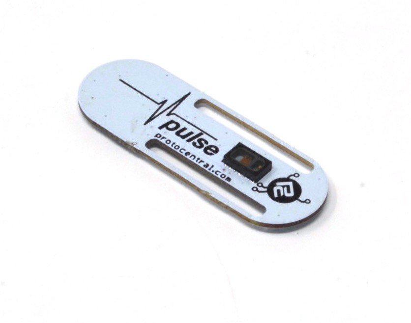

Pulse
================================

[Dont have it yet? Buy one here: Pulse+ Pulse-Ox & Heart Rate Sensor based on MAX30102 (PC-MED-0402)](https://protocentral.com/product/pulse-pulse-ox-heart-rate-sensor-based-on-max30102/)

This is the new Pulse Plus building on our earlier Pulse board by adding the new MAX30102 chip from Maxim that provides better performance.

The Pulse sensor board from ProtoCentral is our new addition to our open medical hardware line-up. Maxim's MAX30100 is a great new product that combines everything required for a pulse oximeter (including the LEDs and Photodiode !!) on a single tiny chip.

Measuring 14 mm wide and 40 mm long, this board is easily wearable on the finger to measure the pulse of blood. We even provide a Velcro strap to hold it.
Important Note: This device is only meant to be used for Research purposes and is NOT to be used as a medical device. This product is not FDA, CE or FCC approved for consumer use. 

Features:
* Integrates a complete pulse oximeter including the optics. No need for a separate probe. 
* Easy-to-use I2C interface to connect to any host microcontroller
* 880 nm Infrared and 660 nm Red LEDs
* Arduino library available
* Calculates Spo2 values with provided code
* Real-time display of PPG (Photoplethysmogram)

Includes:
----------
* 1x ProtoCentral Pulse Oximeter breakout
* 1x Welgro strap

Repository Contents
-------------------
* **/Software** - Arduino and Processing library and example sketches.
* **/Hardware** - All Eagle design files (.brd, .sch)
* **/extras** -   includes the datasheet

Wiring the Breakout to your Arduino
------------------------------------
Connection with the Arduino board is as follows:
 
|Pulse pin label   | Arduino Connection   |Pin Function      |
|----------------- |:--------------------:|-----------------:|
| VCC              | +5V                  |  Supply voltage  |             
| SCL              | A5                   |  Serial clock    |
| SDA              | A4                   |  Serial data     |
| GND              |                      |  Gnd             |

Using Processing - Data Visualization Software (New!)
-----------------------------------------------------
 Processing is a data visualization software, in existence since 2001, used by artists and scientists alike. It’s an open source coding framework based on Java. If you are familiar with the Arduino environment, the Processing IDE is similar and you won’t have much of a learning curve to climb!
 
 The following are the steps to run the code:

### 1. Download Processing for your operating system

 Download the processing ide latest version from the link

* [MAC] (http://download.processing.org/processing-3.2.1-macosx.zip)
* [Linux 32-bit] (http://download.processing.org/processing-3.2.1-linux32.tgz)
* [Linux 64-bit] (http://download.processing.org/processing-3.2.1-linux64.tgz)
* [Windows 32-bit] (http://download.processing.org/processing-3.2.1-windows32.zip)
* [Windows 64-bit] (http://download.processing.org/processing-3.2.1-windows64.zip)

 Once downloaded, unzip the archive and install the app as per your OS.

### 2. Download the Processing code for Pulse Oximeter visualization

 a. Download the necessary files & directories or clone to your desktop from GitHub.

 b. Unzipping the archive should make a folder by name Pulse that contains the visualization code.

 c. Locate the Processing sketchbook directory on your computer. This should have been created automatically when you installed processing. Depending on your operating system, the path will be as follows:

* On Windows: c:/My Documents/Processing/
* On MAC: /Users/your_user_name/Documents/Processing/
* On Linux: /Home/your_user_name/sketchbook/

**Note:** This directory appears as "Processing" on Windows/Mac, and goes by the name "Sketchbook" on Linux. Create a subdirectory by name "libraries" if one doesn't exist already.

 d. From the above mentioned "Pulse" directory Copy/Move the contents of the Pulse-master/Software/Processing/openview_oximeter folder to the Processing sketchbook directory which is also mentioned above (Locate the Processing sketchbook)

 e. Finally, copy the G4P directories from Pulse-master\Processing\libraries and paste them into the libraries directory of your Processing sketchbook.

 f. You are all set now to get your first PPG wave form and SpO2 reading visualized from the Pulse!

### 3. Open Processing & launch the openview_oximeter

 a. If Processing IDE was open, close it and reopen to refresh the libraries and sketches. The repositories are not refreshed if the IDE was open while the Sketches and Libraries were being updated.

 b. Double-click any of the .pde files in the openview_oximeter directory to open all of the pulse oximeter code in the Processing IDE.

 c. If everything done so far was good, clicking the "run" button on the top left corner of the IDE, should run the code! If it does not, make sure you installed your libraries correctly.

 d. Once the GUI is running, select the port connect with pulse oximeter shield from the "SELECT PORT" dropdown as shown in the figure below

 e. Once the port selection is appropriate the START button gets enabled. Click "START" to initiate visualization

 f. You should see the PPG ( RED and IR) waves generated with the values obtained from the Pulse as shown below.

License Information
===================

This product is open source! Both, our hardware and software are open source and licensed under the following licenses:

Hardware
---------

**All hardware is released under [Creative Commons Share-alike 4.0 International](http://creativecommons.org/licenses/by-sa/4.0/).**

You are free to:

* Share — copy and redistribute the material in any medium or format
* Adapt — remix, transform, and build upon the material for any purpose, even commercially.
The licensor cannot revoke these freedoms as long as you follow the license terms.

Under the following terms:

* Attribution — You must give appropriate credit, provide a link to the license, and indicate if changes were made. You may do so in any reasonable manner, but not in any way that suggests the licensor endorses you or your use.
* ShareAlike — If you remix, transform, or build upon the material, you must distribute your contributions under the same license as the original.

Software
--------

**All software is released under the MIT License(http://opensource.org/licenses/MIT).**

THE SOFTWARE IS PROVIDED "AS IS", WITHOUT WARRANTY OF ANY KIND, EXPRESS OR IMPLIED, INCLUDING BUT NOT LIMITED TO THE WARRANTIES OF MERCHANTABILITY, FITNESS FOR A PARTICULAR PURPOSE AND NONINFRINGEMENT. IN NO EVENT SHALL THE AUTHORS OR COPYRIGHT HOLDERS BE LIABLE FOR ANY CLAIM, DAMAGES OR OTHER LIABILITY, WHETHER IN AN ACTION OF CONTRACT, TORT OR OTHERWISE, ARISING FROM, OUT OF OR IN CONNECTION WITH THE SOFTWARE OR THE USE OR OTHER DEALINGS IN THE SOFTWARE.

Please check [*LICENSE.md*](LICENSE.md) for detailed license descriptions.

